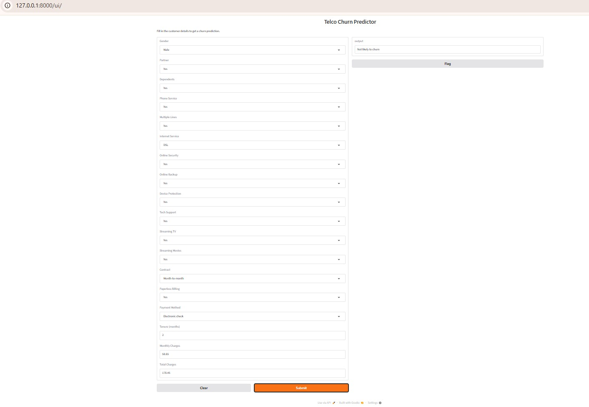

##  Problem Statement

Customer churn is a major challenge for subscription-based businesses.  
This project helps businesses identify high-risk customers early so they can take preventive actions to improve retention.

##  Tech Stack

- Python 
- Pandas, NumPy
- Scikit-learn
- XGBoost
- FastAPI
- Gradio
- Joblib

##  Project Structure

customer-churn-project/
│
├── artifacts/                          
│   ├── model.pkl                      
│   ├── preprocessing.pkl             
│   └── features_columns.pkl          
│
├── data/                              
│   ├── raw/                         
│   └── processed/  
│
├── src/                              
│   │
│   ├── app/                          
│   │   └── app.py                    
│   │
│   ├── data/                          
│   │   ├── load.py                 
│   │   └── pre_processing.py     
│   │
│   ├── features/                   
│   │   └── build_features.py
│   │
│   ├── model_training/              
│   │   ├── train.py                
│   │   ├── tune.py                  
│   │   └── evaluate.py              
│   │
│   ├── scripts/                    
│   │   └── run_pipeline.py
│   │
│   ├── serving/                      
│   │   └── inference.py
│   │
│   └── utils/                       
│       ├── logger.py
│       └── validate.py
│
├── requirements.txt
└── README.md

##  Workflow

1. Data Loading, preprocessing & cleaning  
2. Feature engineering  
3. Encoding categorical variables
4. Best Model and Parameters Selection 
5. Final Model training (XGBoost Classifier)  
6. Model evaluation  
7. Save trained model  
8. Serve predictions via FastAPI  
9. UI interaction via Gradio

## Run Locally

###  Clone Repository

git clone https://github.com/Robin2883/Customer-Churn-Prediction-Project.git
cd customer-churn-project

-  Install Dependencies

pip install -r requirements.txt

-  Run Application

python -m src.app.app

-  Open UI

http://127.0.0.1:8000/ui/

-  Model Details
Model: XGBoost Classifier
Target: Customer Churn (Yes/No)
Input Features: Tenure, Contract, Monthly Charges, Services, etc.
Evaluation Metrics: Accuracy, Precision, Recall, F1-score

-  Gradio UI

-  Future Improvements

Integrate with MLFlow
Deploy on AWS
Dockerize whole project
Store predictions in database
Improve UI dashboard 

-  Author

Md Kamrul Hassan Robin
Machine Learning Enthusiast | Data Science Developer

-  Show Your Support

If you like this project, give it a ⭐ on GitHub!
